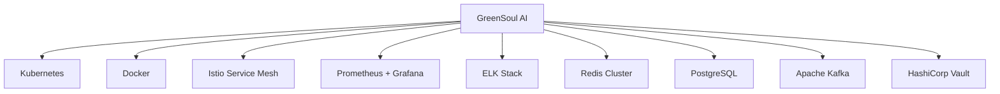

# 🌿 GreenSoul AI

[](https://golang.org)
[](LICENSE)
[](https://github.com/ynl/greensoulai)
[](docs/deployment.md)
[](docs/enterprise.md)

> **塑造AI的未来，一个智能体一个生态**

**GreenSoul AI** 是下一代多智能体协作平台，专为Go生态和规模化微服务架构而生。我们的愿景是构建最完善的多智能体Go生态系统，让AI无缝集成到企业级微服务架构中，释放分布式智能的无限潜力。

## 🎯 我们的愿景

**完善多智能体的Go生态** - 我们致力于建设Go语言最强大的多智能体协作平台
**AI集成规模化微服务** - 将人工智能能力深度融入现代微服务架构
**企业级生产就绪** - 提供可靠、安全、高性能的企业级AI解决方案

## 🌟 核心优势

### 🏗️ 微服务架构原生支持
- **🔗 无缝集成**: 与现有Go微服务栈完美融合
- **📡 分布式智能体**: 跨服务的智能体协作和通信
- **⚡ 云原生部署**: Kubernetes、Docker、Service Mesh就绪
- **🔄 事件驱动**: 基于事件的松耦合架构

### 🚀 企业级性能
- **⚡ 极致性能**: 比Python版本提升2-3倍执行效率
- **💪 高并发**: 单节点支持1000+并发智能体
- **🔋 资源优化**: 低内存占用，高效资源利用
- **📦 零依赖部署**: 单二进制文件，生产环境开箱即用

### 🛡️ 生产就绪
- **🔒 企业安全**: 内置安全指纹、访问控制、审计日志
- **📊 可观测性**: 完整的指标、链路追踪、健康检查
- **🛠️ 运维友好**: 优雅关闭、热重载、配置管理
- **⚠️ 容错设计**: 断路器、重试机制、降级策略

### 🌐 开放生态
- **🔌 工具生态**: 丰富的内置工具和第三方工具支持
- **🤖 模型无关**: 支持OpenAI、Claude、本地模型等
- **📚 知识管理**: 向量数据库、文档检索、知识图谱
- **🎯 类型安全**: 强类型系统确保运行时可靠性

## 🏗️ 架构设计

### 微服务友好的分层架构

```
┌─────────────────────────────────────────────────────────┐
│                   🌐 API Gateway                        │
├─────────────────────────────────────────────────────────┤
│  🤖 智能体服务    │  📊 工作流服务   │  💾 知识服务      │
├─────────────────────────────────────────────────────────┤
│  📨 事件总线      │  🔒 安全服务     │  📈 监控服务      │
├─────────────────────────────────────────────────────────┤
│            🗃️ 持久化层 (数据库/缓存/消息队列)              │
└─────────────────────────────────────────────────────────┘
```

### 项目结构

```
greensoulai/
├── cmd/                     # 🚀 微服务入口
│   └── greensoulai/        #    主服务程序
├── internal/               # 🏢 核心业务逻辑
│   ├── agent/             #    智能体协作引擎
│   ├── crew/              #    团队编排服务
│   ├── task/              #    任务执行引擎
│   ├── flow/              #    工作流编排器
│   ├── tools/             #    工具集成框架
│   ├── memory/            #    分布式记忆系统
│   ├── llm/               #    LLM服务适配器
│   ├── knowledge/         #    知识管理服务
│   ├── evaluation/        #    性能评估系统
│   └── training/          #    持续学习引擎
├── pkg/                    # 📦 共享基础设施
│   ├── events/            #    事件驱动架构
│   ├── async/             #    异步执行框架
│   ├── security/          #    企业安全框架
│   ├── logger/            #    结构化日志
│   ├── errors/            #    错误处理体系
│   └── flow/              #    分布式工作流
├── examples/              # 📚 实战示例
│   ├── basic/            #    入门示例
│   ├── llm/              #    模型集成
│   ├── workflow/         #    工作流示例
│   ├── crew/             #    团队协作
│   └── training/         #    持续学习
├── docs/                  # 📖 完整文档
│   ├── WORKFLOW_ARCHITECTURE.md
│   ├── PROJECT_STRUCTURE.md
│   └── FINAL_FLOW_DESIGN.md
└── deployments/           # ☁️ 云原生部署
    ├── docker/           #    容器化配置
    ├── k8s/              #    Kubernetes清单
    └── helm/             #    Helm图表
```

## 🚀 快速开始

### 📦 安装部署

#### Go模块安装
```bash
go install github.com/ynl/greensoulai/cmd/greensoulai@latest
```

#### Docker部署 (生产推荐)
```bash
docker run -d --name greensoulai \
  -p 8080:8080 \
  -e OPENAI_API_KEY=${OPENAI_API_KEY} \
  greensoulai/greensoulai:latest
```

#### Kubernetes部署
```bash
kubectl apply -f deployments/k8s/
```

### 🎯 场景示例

#### 1. 微服务内集成 - 智能客服系统
```go
package main

import (
    "context"
    "net/http"
    
    "github.com/gin-gonic/gin"
    "github.com/ynl/greensoulai/internal/agent"
    "github.com/ynl/greensoulai/internal/crew"
    "github.com/ynl/greensoulai/pkg/events"
    "github.com/ynl/greensoulai/pkg/logger"
)

func main() {
    // 初始化基础设施
    logger := logger.NewStructuredLogger()
    eventBus := events.NewEventBus(logger)
    
    // 创建专业智能体团队
    supportAgent := agent.NewBaseAgent(
        "客服专家", 
        "提供专业客户支持",
        "你是经验丰富的客服专家，善于解决各种客户问题", 
        openaiLLM, eventBus, logger)
    
    technicalAgent := agent.NewBaseAgent(
        "技术专家",
        "处理技术相关问题", 
        "你是资深技术专家，精通产品技术细节",
        openaiLLM, eventBus, logger)
    
    // 构建协作团队
    customerServiceCrew := crew.NewBaseCrew(
        "智能客服团队", 
        eventBus, logger)
    customerServiceCrew.AddAgent(supportAgent)
    customerServiceCrew.AddAgent(technicalAgent)
    
    // 集成到Web服务
    r := gin.Default()
    r.POST("/api/support", func(c *gin.Context) {
        var req CustomerQuery
        c.ShouldBindJSON(&req)
        
        // 智能体协作处理请求
        result, err := customerServiceCrew.Process(c.Request.Context(), req)
        if err != nil {
            c.JSON(500, gin.H{"error": err.Error()})
            return
        }
        
        c.JSON(200, result)
    })
    
    r.Run(":8080")
}
```

#### 2. 工作流编排 - 自动化报告生成
```go
package main

import (
    "context"
    
    "github.com/ynl/greensoulai/pkg/flow"
    "github.com/ynl/greensoulai/internal/agent"
)

func main() {
    // 定义分布式工作流
    workflow := flow.NewWorkflow("market-analysis-pipeline")
    
    // 数据收集阶段
    workflow.AddStep("data_collection", func(ctx context.Context, input interface{}) (interface{}, error) {
        dataCollector := agent.NewAgent("Data Analyst", "收集市场数据", "...")
        return dataCollector.Execute(ctx, task.NewTask("收集最新市场数据"))
    })
    
    // 智能分析阶段  
    workflow.AddStep("analysis", func(ctx context.Context, input interface{}) (interface{}, error) {
        analysisTeam := crew.NewCrew("分析团队")
        return analysisTeam.Process(ctx, input)
    })
    
    // 报告生成阶段
    workflow.AddStep("report_generation", func(ctx context.Context, input interface{}) (interface{}, error) {
        reporterAgent := agent.NewAgent("Report Writer", "生成专业报告", "...")
        return reporterAgent.Execute(ctx, task.NewTask("生成市场分析报告"))
    })
    
    // 执行工作流
    result, err := workflow.Execute(context.Background(), MarketQuery{
        Industry: "AI/ML",
        Region:   "Global",
        Period:   "Q4 2024",
    })
    
    if err != nil {
        log.Fatal(err)
    }
    
    fmt.Printf("报告生成完成: %+v\n", result)
}
```

#### 3. 事件驱动架构 - 实时智能响应
```go
package main

import (
    "context"
    
    "github.com/ynl/greensoulai/pkg/events"
    "github.com/ynl/greensoulai/internal/agent"
)

func main() {
    eventBus := events.NewEventBus(logger)
    
    // 创建响应智能体
    alertAgent := agent.NewAgent("Alert Handler", "处理系统告警", "...")
    anomalyAgent := agent.NewAgent("Anomaly Detector", "异常检测分析", "...")
    
    // 注册事件监听器
    eventBus.Subscribe("system.alert", func(ctx context.Context, event events.Event) error {
        // 智能体自动响应系统告警
        response, err := alertAgent.Execute(ctx, task.NewTask(
            fmt.Sprintf("分析告警: %s", event.GetPayload()["message"])))
        
        // 自动采取修复措施
        if response.Confidence > 0.8 {
            return executeRemediation(response.RecommendedActions)
        }
        
        return nil
    })
    
    // 监听业务事件
    eventBus.Subscribe("business.anomaly", func(ctx context.Context, event events.Event) error {
        return anomalyAgent.Execute(ctx, task.NewTask("异常行为分析"))
    })
    
    // 启动事件监听
    eventBus.Start(context.Background())
}
```

## 🏢 企业级应用场景

### 💼 行业解决方案

| 行业 | 应用场景 | 核心价值 |
|------|----------|----------|
| **金融服务** | 智能风控、投资分析、客户服务 | 提升决策精度，降低合规风险 |
| **电商零售** | 个性化推荐、库存优化、用户分析 | 优化用户体验，提升转化率 |
| **制造业** | 预测性维护、质量控制、供应链优化 | 降低运营成本，提升效率 |
| **医疗健康** | 辅助诊断、药物发现、患者管理 | 提升医疗质量，加速研发 |
| **教育科技** | 个性化学习、智能辅导、内容生成 | 因材施教，提升学习效果 |

### 🔗 技术栈集成



## 📚 完整文档

### 📖 开发指南
- [🚀 快速开始](docs/quickstart.md) - 5分钟上手指南
- [🏗️ 架构详解](docs/WORKFLOW_ARCHITECTURE.md) - 深入理解系统架构
- [📋 项目结构](docs/PROJECT_STRUCTURE.md) - 代码组织和模块说明
- [🔄 工作流设计](docs/FINAL_FLOW_DESIGN.md) - 工作流引擎详解

### 🛠️ 部署运维
- [☁️ 云原生部署](docs/deployment/cloud-native.md) - Kubernetes + Helm
- [🐳 容器化指南](docs/deployment/docker.md) - Docker最佳实践
- [📊 监控告警](docs/deployment/monitoring.md) - 生产环境监控
- [🔒 安全加固](docs/deployment/security.md) - 企业级安全配置

### 💡 最佳实践
- [🎯 设计模式](docs/patterns/README.md) - 多智能体设计模式
- [⚡ 性能优化](docs/performance/README.md) - 高并发性能调优
- [🔧 故障排查](docs/troubleshooting/README.md) - 常见问题解决
- [📈 扩展指南](docs/scaling/README.md) - 水平扩展策略

### 🚀 实战案例
- [🛒 电商推荐系统](examples/ecommerce/) - 完整的推荐引擎实现
- [📈 金融风控平台](examples/fintech/) - 实时风险评估系统
- [🏥 智能客服机器人](examples/customer-service/) - 多轮对话处理
- [📊 数据分析管道](examples/data-pipeline/) - 自动化报告生成

## 🌐 GreenSoul AI 生态系统

### 🔧 官方工具集
- **🎛️ GreenSoul Console** - 可视化管理控制台
- **📊 GreenSoul Analytics** - 智能体性能分析平台  
- **🔌 GreenSoul Gateway** - API网关和负载均衡
- **📦 GreenSoul Registry** - 智能体和工具注册中心

### 🤝 社区插件
- **🔍 Search Tools** - 搜索引擎和爬虫工具集
- **📄 Document Processors** - 文档解析和处理工具
- **💾 Database Connectors** - 多数据库连接器
- **🌍 External APIs** - 第三方API集成工具

### 🎓 学习资源
- **📚 官方教程** - 从入门到精通的完整学习路径
- **🎥 视频课程** - 实战项目和案例分析
- **👥 社区论坛** - 开发者交流和问题讨论
- **📝 技术博客** - 最新技术趋势和实践分享

## 🧪 开发环境

### ⚙️ 本地开发
```bash
# 克隆项目
git clone https://github.com/ynl/greensoulai.git
cd greensoulai

# 安装依赖
go mod download

# 运行测试
make test

# 构建项目
make build

# 启动开发服务
make dev
```

### 🐳 容器化开发
```bash
# 构建开发镜像
make docker-dev

# 启动开发环境
docker-compose -f docker-compose.dev.yml up
```

### 🔍 代码质量检查
```bash
# 静态分析
make lint

# 安全扫描  
make security-scan

# 性能基准测试
make benchmark

# 集成测试
make integration-test
```

## 💖 社区与生态

### 🌟 核心理念
**开放协作** - 我们相信开源的力量能推动AI技术的民主化
**企业级品质** - 每一行代码都经过严格测试，确保生产环境可靠性
**持续创新** - 紧跟AI技术前沿，不断优化和完善功能

### 🚀 发展路线图
- **Q1 2025**: 完成核心多智能体框架和工作流引擎
- **Q2 2025**: 发布企业级监控和管理工具
- **Q3 2025**: 支持更多LLM提供商和本地模型
- **Q4 2025**: 构建完整的可视化开发平台

### 🤝 参与贡献
我们热烈欢迎各种形式的贡献：
- **🐛 报告Bug** - 发现问题请提交Issue
- **💡 功能建议** - 好想法请在Discussions中分享
- **📝 代码贡献** - 欢迎提交Pull Request
- **📚 文档完善** - 帮助改进文档和示例
- **🎯 测试反馈** - 在你的项目中使用并分享经验

### 📞 联系我们
- **💬 技术支持**: [GitHub Issues](https://github.com/ynl/greensoulai/issues)
- **💭 产品讨论**: [GitHub Discussions](https://github.com/ynl/greensoulai/discussions) 
- **📧 商务合作**: business@greensoulai.com
- **🔗 官方网站**: [greensoulai.com](https://greensoulai.com)
- **📱 官方微信**: GreenSoulAI-Official

---

<div align="center">

**🌿 GreenSoul AI - 让每一个智能体都绽放生命力**

[](https://star-history.com/#ynl/greensoulai&Date)

*Built with ❤️ by the GreenSoul AI Team*

</div>
