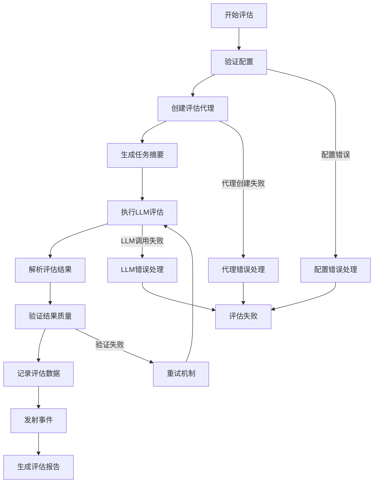

# GreenSoulAI 评估系统

## 📊 概述

评估系统是GreenSoulAI框架的质量保证核心模块，负责对Crew、Agent和Task的执行质量进行评估和分析。本模块完全对标Python版本的crewAI评估功能，提供企业级的评估能力。

## 🏗️ 架构设计

### 核心组件

```
评估系统架构
├── 数据模型层 (models.go)
│   ├── EvaluationScore - 评估分数
│   ├── TaskEvaluation - 任务评估结果  
│   ├── CrewEvaluationResult - Crew评估结果
│   └── 配置和度量类别定义
├── 接口定义层 (interfaces.go)
│   ├── CrewEvaluator - Crew评估器接口
│   ├── TaskEvaluator - 任务评估器接口
│   └── BaseEvaluator - 基础评估器接口
├── 实现层
│   ├── CrewEvaluatorImpl - Crew评估器实现
│   ├── TaskEvaluatorImpl - 任务评估器实现
│   └── 各种专用评估器
├── 事件系统 (events.go)
│   ├── 评估生命周期事件
│   ├── 任务评估事件
│   └── 会话管理事件
└── 错误处理 (errors.go)
    ├── 评估执行错误
    ├── 配置验证错误
    └── LLM响应错误
```

### 评估流程



## 🚀 功能特性

### ✅ 已实现功能

#### 1. **CrewEvaluator** - Crew评估器
- **功能**: 评估整个Crew的执行性能
- **Python对标**: 完全对应`crewai.utilities.evaluators.crew_evaluator_handler.CrewEvaluator`
- **核心方法**:
  - `SetupForEvaluating()` - 设置评估环境
  - `Evaluate()` - 执行评估
  - `PrintCrewEvaluationResult()` - 打印评估结果
  - `GetEvaluationResult()` - 获取评估数据

#### 2. **TaskEvaluator** - 任务评估器
- **功能**: 评估单个任务的执行质量
- **Python对标**: 完全对应`crewai.utilities.evaluators.task_evaluator.TaskEvaluator`
- **核心方法**:
  - `Evaluate()` - 评估任务输出
  - `EvaluateTrainingData()` - 评估训练数据

#### 3. **数据模型系统**
- **EvaluationScore**: 评估分数和反馈
- **TaskEvaluation**: 详细的任务评估结果
- **CrewEvaluationResult**: Crew级别的评估统计
- **TrainingTaskEvaluation**: 训练任务评估结果

#### 4. **事件驱动架构**
- 完整的评估生命周期事件
- 与Python版本一致的事件类型
- 支持外部监听器集成

#### 5. **错误处理系统**
- 多层次错误类型定义
- 错误链式传播
- 详细的错误上下文信息

#### 6. **配置管理**
- 灵活的评估配置
- 支持多种评估指标类别
- 配置验证和默认值

### 📊 评估指标

#### 支持的度量类别
- `goal_alignment` - 目标对齐度
- `semantic_quality` - 语义质量  
- `task_completion` - 任务完成度
- `efficiency` - 效率
- `accuracy` - 准确性
- `creativity` - 创造性
- `coherence` - 连贯性
- `relevance` - 相关性

#### 评分系统
- **评分范围**: 0-10分
- **及格线**: 6.0分（可配置）
- **等级映射**: A+ (9+), A (8+), B (7+), C (6+), D (5+), F (<5)

## 🔧 使用示例

### 基本用法

```go
package main

import (
    "context"
    "fmt"
    
    "github.com/ynl/greensoulai/internal/evaluation"
    "github.com/ynl/greensoulai/internal/llm"
    "github.com/ynl/greensoulai/pkg/events"
    "github.com/ynl/greensoulai/pkg/logger"
)

func main() {
    // 1. 创建依赖
    eventBus := events.NewEventBus()
    logger := logger.NewLogger()
    evalLLM := llm.NewOpenAILLM("your-api-key", "gpt-4o-mini", eventBus, logger)
    
    // 2. 创建评估配置
    config := evaluation.DefaultEvaluationConfig()
    config.EnableVerbose = true
    config.PassingScore = 7.0
    
    // 3. 创建Crew评估器
    crewEvaluator := evaluation.NewCrewEvaluator(
        crew,           // 你的crew实例
        evalLLM,        // 评估用的LLM
        config,         // 评估配置
        eventBus,       // 事件总线
        logger,         // 日志器
    )
    
    // 4. 设置评估环境
    ctx := context.Background()
    err := crewEvaluator.SetupForEvaluating(ctx, crew)
    if err != nil {
        log.Fatal("Failed to setup evaluation:", err)
    }
    
    // 5. 执行crew任务（评估会自动进行）
    result, err := crew.Execute(ctx, inputs)
    if err != nil {
        log.Fatal("Crew execution failed:", err)
    }
    
    // 6. 打印评估结果
    err = crewEvaluator.PrintCrewEvaluationResult(ctx)
    if err != nil {
        log.Fatal("Failed to print results:", err)
    }
    
    // 7. 获取详细评估数据
    evalResult := crewEvaluator.GetEvaluationResult()
    fmt.Printf("Average Score: %.2f\n", evalResult.AverageScore)
    fmt.Printf("Success Rate: %.1f%%\n", evalResult.SuccessRate)
    fmt.Printf("Performance Grade: %s\n", evalResult.GetPerformanceGrade())
}
```

### 任务评估

```go
// 创建任务评估器
taskEvaluator := evaluation.NewTaskEvaluator(
    originalAgent,  // 执行任务的原始agent
    evalLLM,        // 评估用的LLM
    config,         // 评估配置
    eventBus,       // 事件总线
    logger,         // 日志器
)

// 评估任务执行结果
evaluation, err := taskEvaluator.Evaluate(ctx, task, output)
if err != nil {
    log.Fatal("Task evaluation failed:", err)
}

fmt.Printf("Task Score: %.1f (%s)\n", evaluation.GetOverallScore(), evaluation.GetGrade())
fmt.Printf("Feedback: %s\n", evaluation.Feedback)
for _, suggestion := range evaluation.Suggestions {
    fmt.Printf("- %s\n", suggestion)
}
```

### 事件监听

```go
// 订阅评估事件
eventBus.Subscribe(evaluation.EventTypeEvaluationCompleted, func(ctx context.Context, event events.Event) error {
    if completedEvent, ok := event.(*evaluation.EvaluationCompletedEvent); ok {
        fmt.Printf("Evaluation completed: %s with score %.1f\n", 
            completedEvent.TargetName, completedEvent.Score)
    }
    return nil
})

// 订阅Crew测试结果事件（对应Python版本）
eventBus.Subscribe(evaluation.EventTypeCrewTestResult, func(ctx context.Context, event events.Event) error {
    if testEvent, ok := event.(*evaluation.CrewTestResultEvent); ok {
        fmt.Printf("Crew Test Result: Quality=%.1f, Duration=%.1fms, Model=%s\n",
            testEvent.Quality, testEvent.ExecutionDuration, testEvent.Model)
    }
    return nil
})
```

## 🧪 测试覆盖

### 测试组织
- **models_test.go**: 数据模型测试（55个测试用例）
- **errors_test.go**: 错误处理测试（25个测试用例）  
- **events_test.go**: 事件系统测试（17个测试用例）

### 测试覆盖范围
```
✅ 数据模型验证
✅ JSON序列化/反序列化
✅ 评分计算逻辑
✅ 统计分析功能
✅ 配置验证
✅ 错误创建和传播
✅ 事件生成和字段一致性
✅ 边界条件处理
✅ 并发安全性（通过RWMutex）
```

### 运行测试

```bash
# 运行所有评估系统测试
go test ./internal/evaluation -v

# 运行特定测试
go test ./internal/evaluation -run TestCrewEvaluator -v

# 生成测试覆盖率报告
go test ./internal/evaluation -cover
```

## 🔄 与Python版本对比

### ✅ 完全实现的功能
- [x] CrewEvaluator类功能
- [x] TaskEvaluator类功能
- [x] 评估分数计算
- [x] 评估结果打印
- [x] CrewTestResultEvent事件
- [x] 训练数据评估
- [x] 配置管理系统
- [x] 错误处理机制

### ⚠️ 当前限制
- **Agent系统依赖**: CrewEvaluator中的代理创建需要完整的Agent系统
- **Task系统依赖**: 评估任务创建需要Task系统支持
- **Mock实现**: 当前使用Mock实现处理缺失的依赖

### 🔮 待完善项目
- [ ] BaseEvaluator具体实现
- [ ] AgentEvaluator完整实现  
- [ ] EvaluationSession会话管理
- [ ] 与Agent/Task系统的完整集成

## 📈 性能特性

### 并发安全
- 使用`sync.RWMutex`保护共享状态
- 支持并发评估操作
- 线程安全的结果收集

### 内存管理
- 深拷贝避免数据竞争
- 及时清理临时数据
- 可配置的资源限制

### 事件处理
- 异步事件发射
- 非阻塞评估回调
- 可扩展的事件监听

## 🔧 配置选项

### EvaluationConfig
```go
type EvaluationConfig struct {
    EvaluatorLLM     string             // 评估LLM模型
    EnableVerbose    bool               // 详细日志开关
    MaxRetries       int                // 最大重试次数
    TimeoutSeconds   int                // 超时时间（秒）
    PassingScore     float64            // 及格分数线
    Categories       []MetricCategory   // 评估类别
    CustomCriteria   map[string]string  // 自定义标准
    Metadata         map[string]interface{} // 元数据
}
```

### 默认配置
```go
config := &EvaluationConfig{
    EvaluatorLLM:   "gpt-4o-mini",
    EnableVerbose:  false,
    MaxRetries:     3,
    TimeoutSeconds: 60,
    PassingScore:   6.0,
    Categories: []MetricCategory{
        MetricCategoryGoalAlignment,
        MetricCategorySemanticQuality,
        MetricCategoryTaskCompletion,
    },
}
```

## 🚀 未来扩展计划

### 短期计划
1. **Agent系统集成**: 完整的Agent创建和管理
2. **Task系统集成**: 支持真实的Task创建和执行
3. **评估器扩展**: 实现更多专用评估器

### 长期计划  
1. **机器学习增强**: 基于历史数据的智能评估
2. **可视化报告**: 生成图表和仪表板
3. **A/B测试支持**: 对比不同Crew配置的性能
4. **实时监控**: 在线评估和告警系统

## 📚 相关文档

- [项目分析报告](../../PROJECT_ANALYSIS.md)
- [Python版本对比](../../crewAI-Go%20完整实施指引.md)
- [事件系统文档](../../pkg/events/README.md)
- [日志系统文档](../../pkg/logger/README.md)

---

*本评估系统是GreenSoulAI框架质量保证的核心，确保与Python版本的完全兼容性和企业级的可靠性。*
